# Agente de Monitoramento de SRAG com IA Generativa

> Uma solução de ponta a ponta que automatiza a coleta, análise e geração de relatórios sobre a Síndrome Respiratória Aguda Grave (SRAG) no Brasil, utilizando um agente de IA autônomo.

Este projeto implementa um sistema robusto que transforma dados públicos brutos do OpenDataSUS em um relatório de inteligência acionável. A solução combina um pipeline de engenharia de dados, um agente de IA orquestrado com LangGraph e uma interface web interativa construída com Streamlit.

---

## Visão Geral do Projeto

O monitoramento de síndromes respiratórias é uma tarefa complexa que envolve a análise de grandes volumes de dados epidemiológicos e a contextualização com notícias e eventos atuais. Este projeto resolve esse desafio ao automatizar todo o fluxo de trabalho:

1.  **Extração e Processamento (ETL):** Os dados mais recentes de SRAG são baixados do portal OpenDataSUS, limpos, transformados e carregados em um banco de dados local (SQLite).
2.  **Análise e Geração de Insights:** Um agente de IA autônomo, dotado de ferramentas especializadas, consulta o banco de dados para extrair métricas-chave e busca na web por notícias relevantes para contextualizar os achados.
3.  **Geração de Relatório:** O agente sintetiza todas as informações coletadas (métricas quantitativas e contexto qualitativo) em um relatório técnico estruturado, seguindo as melhores práticas de vigilância em saúde.
4.  **Apresentação Interativa:** Uma aplicação web permite que qualquer usuário acione todo o pipeline com um único clique e visualize o relatório e os gráficos gerados.

## Funcionalidades Principais

* **Pipeline de Dados Automatizado:** Extração assíncrona e eficiente de dados `.parquet` diretamente do OpenDataSUS.
* **Agente Autônomo com LangGraph:** O núcleo da solução é um agente inteligente que planeja e executa uma sequência de tarefas para atingir seu objetivo.
* **Arquitetura Multi-Ferramentas (Multi-Tool):**
    * **Ferramenta SQL:** Permite que o agente converse com o banco de dados em linguagem natural para obter métricas precisas.
    * **Ferramenta de RAG (Retrieval-Augmented Generation):** Busca notícias recentes na web, as processa e utiliza um sistema de busca híbrida (semântica + palavra-chave) para encontrar o contexto mais relevante, mitigando alucinações.
* **Geração de Gráficos Automatizada:** Criação automática de visualizações sobre a evolução de casos diários e mensais.
* **Interface Web Intuitiva:** Um dashboard simples e poderoso construído com Streamlit para facilitar a interação e a visualização dos resultados.

## Arquitetura da Solução

A arquitetura foi projetada de forma modular, separando as responsabilidades em três grandes fases que são orquestradas pela aplicação principal:



1.  **Fase 1: Preparação de Dados (ETL & Gráficos)**
    * O `app.py` aciona o `build_database.py`, que por sua vez utiliza os módulos `data_extractor`, `data_loader` e `data_transformer` para construir o banco de dados `srag_data.db`. Em seguida, o `chart_generator.py` é chamado para criar os gráficos e salvá-los na pasta `img/`.

2.  **Fase 2: Orquestração com Agente de IA (LangGraph)**
    * O `app.py` inicializa o agente definido em `agent_orchestrator.py`. Este orquestrador gerencia um grafo de estados onde o LLM (GPT-4o) atua como um cérebro, decidindo qual ferramenta (`agent_tools.py`) usar em seguida (SQL ou RAG) ou se já possui informações suficientes para finalizar.

3.  **Fase 3: Geração e Apresentação do Relatório**
    * Após o agente coletar os dados, ele entra no nó final de geração de relatório. O LLM utiliza um *prompt* estruturado para sintetizar as informações em um formato Markdown. A aplicação Streamlit (`app.py`) exibe o relatório e os gráficos para o usuário.

## 🛠️ Tech Stack

| Componente | Tecnologia / Biblioteca | Propósito |
| ----------------- | ------------------------------------------------------------- | ------------------------------------------------------------------ |
| **Orquestração de IA** | LangChain, LangGraph | Construção do agente autônomo, gerenciamento de estado e fluxo cíclico. |
| **Modelo de Linguagem** | OpenAI (GPT-4o) | Raciocínio, planejamento de tarefas e síntese de relatórios. |
| **Engenharia de Dados** | Pandas, aiohttp, BeautifulSoup4 | Extração, transformação e carregamento dos dados de SRAG. |
| **Banco de Dados** | SQLite | Armazenamento local dos dados processados para consulta analítica. |
| **Busca e RAG** | Tavily Search API, FAISS, rank-bm25 | Busca de notícias na web e implementação de recuperação híbrida. |
| **Interface Web** | Streamlit | Criação do dashboard interativo para o usuário final. |
| **Linguagem** | Python 3.9+ | Linguagem principal de desenvolvimento. |

## Estrutura de Pastas do Projeto

```

.
├── .env.example              \# Exemplo de arquivo para variáveis de ambiente
├── .gitignore
├── README.md                 \# Este arquivo
├── app.py                    \# Script principal da aplicação Streamlit
├── build_database.py         \# Script para orquestrar o pipeline de ETL
├── requirements.txt          \# Lista de dependências Python
├── run_project.py            \# Script auxiliar para iniciar a aplicação
│
├── data/
│   ├── .gitkeep
│   └── dicionario_dados.json \# Dicionário para renomear colunas
│
├── docs/
│   └── diagrama_conceitual.pdf \# Diagrama visual da arquitetura
│
├── img/
│   └── .gitkeep                \# Pasta para salvar os gráficos gerados
│
└── src/
├── **init**.py
├── agent_orchestrator.py   \# Define a arquitetura do agente com LangGraph
├── agent_tools.py          \# Implementa as ferramentas SQL e RAG
├── chart_generator.py      \# Script para gerar e salvar os gráficos
├── data_extractor.py       \# Módulo para baixar dados do OpenDataSUS
├── data_loader.py          \# Módulo para carregar e renomear dados
└── data_transformer.py     \# Módulo para limpar e transformar os dados

````

## Como Executar Localmente

Siga os passos abaixo para configurar e executar o projeto em seu ambiente local.

### Pré-requisitos

* Python
* Git

### Passo 1: Clonar o Repositório

```bash
git clone https://github.com/oericdacosta/ai_health_monitor.git
cd ai_health_monitor
````

### Passo 2: Configurar o Ambiente Virtual

É uma boa prática usar um ambiente virtual para isolar as dependências do projeto.

```bash
# Para Linux/macOS
python3 -m venv venv
source venv/bin/activate

# Para Windows
python -m venv venv
.\venv\Scripts\activate
```

### Passo 3: Instalar as Dependências

Instale todas as bibliotecas necessárias a partir do arquivo `requirements.txt`.

```bash
pip install -r requirements.txt
```

### Passo 4: Configurar as Variáveis de Ambiente

Você precisará de chaves de API para a OpenAI e a Tavily.

1.  Crie um arquivo `.env` na raiz do projeto, copiando o exemplo:
    ```bash
    cp .env.example .env
    ```
2.  Abra o arquivo `.env` e adicione suas chaves de API:
    ```
    OPENAI_API_KEY="sk-..."
    TAVILY_API_KEY="tvly-..."
    ```
      * Obtenha sua chave da [OpenAI](https://platform.openai.com/api-keys).
      * Obtenha sua chave da [Tavily](https://app.tavily.com/home).

### Passo 5: Executar a Aplicação

Use o script `run_project.py` para iniciar o servidor Streamlit.

```bash
python run_project.py
```

Acesse a URL local fornecida no terminal (geralmente `http://localhost:8501`) em seu navegador para interagir com a aplicação.

## ⚙️ Como Funciona a Aplicação

Ao abrir a aplicação, você verá um único botão: **"Gerar Relatório Completo"**. Ao clicar nele, o sistema executa a seguinte sequência de tarefas, mostrando o progresso em tempo real:

1.  **Verificação do Ambiente de Dados:** O sistema verifica se os dados brutos e o banco de dados já existem. Se não, ele executa o pipeline de ETL automaticamente.
2.  **Geração de Gráficos:** As visualizações de casos diários e mensais são geradas e salvas.
3.  **Análise do Agente de IA:** O agente é acionado. Ele primeiro usa a **Ferramenta SQL** para obter as métricas, depois a **Ferramenta RAG** para buscar contexto nas notícias.
4.  **Apresentação dos Resultados:** O relatório final em Markdown é renderizado na tela, seguido pelos gráficos.